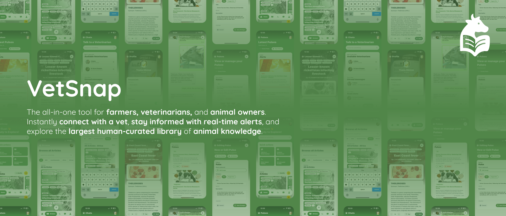
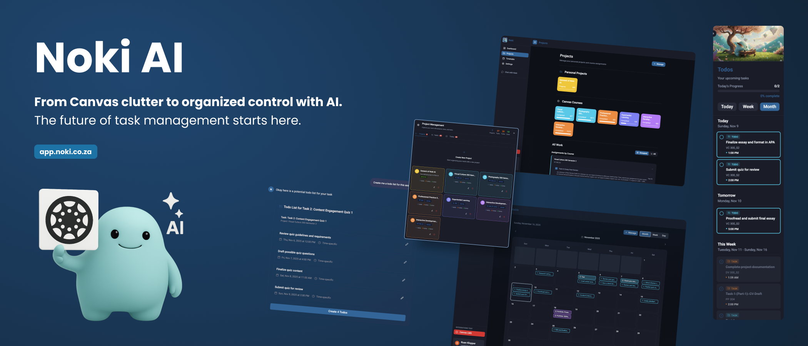
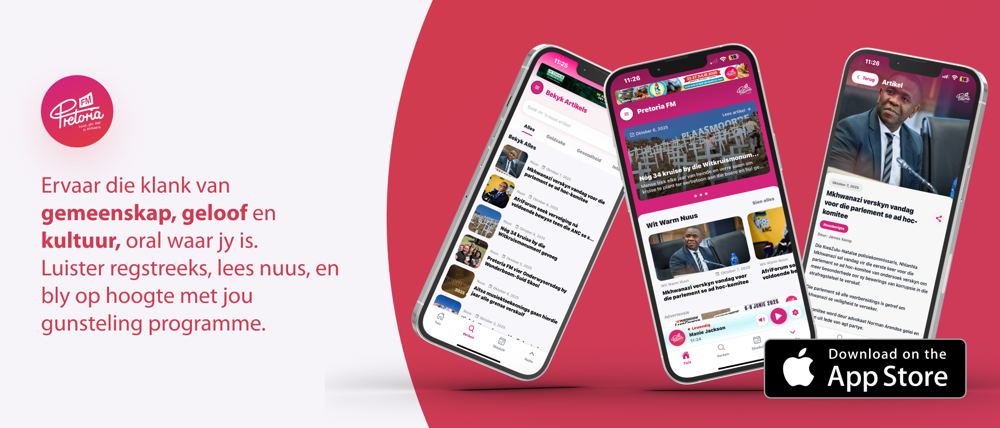

<div align="center">
  
</div>

<div align="center">
  
</div>

<div align="center">


**Full Stack Engineer** • **UX/UI Designer** • **Photographer**  
**Node.js** • **❤️ TypeScript and Tailwind** • **Saving up for a BMW E39 M5**

---


</div>

---

<div align="center">
  
### Tech Stack


</div>

---

## About Me

<div align="center">

_I’m a full stack developer who loves creating SaaS products that make life a little easier, and look good while doing it. I care a lot about clean, thoughtful code and building things that actually help people. When I’m not deep in a project, I’m out with my camera chasing good light or reading up on my dream car, the BMW E39 M5. I do all my work on a Mac, where creativity and code feel right at home._

</div>

---

## What I'm Currently Working On

- Expanding **Noki AI** - features, hopefully I can lauch it soon for students to use Noki AI: Noki AI will soon have a fully featured mobile app
- Learning new design patterns and best practices

---

## Skills & Expertise

### Frontend Development

```
██████████████████░░ 90%
```

**Frameworks:**


**UI Styling:**


**Languages:**


---

### Backend Development

```
████████████████░░░░ 80%
```

**Frameworks:**


**Languages:**


---

### Data & Databases

```
████████████████░░░░ 80%
```


---

### Mobile Development

```
█████████████████░░░ 85%
```


---

### Security, Authentication & Session Management

```
██████████████████░░ 90%
```


---

### Architecture Planning

```
████████████████░░░░ 80%
```

**Entity Relationship Planning** • **Feature Sets** • **MVP**

---

### Testing

```
███████████████░░░░░ 75%
```


---

## Repositories for 2025

### Open Window Semester 1

#### 🌿 Coriander S1.1 & S1.2

<div align="center">
  
</div>


**Description:** Coriander HR is a comprehensive Human Resource Management System built for Coriander to optimize internal operations. Delivered as a cross-platform Electron desktop app with React and Ant Design, it gives staff and administrators dedicated dashboards to handle leave requests, meeting schedules, equipment management, and performance reviews through an intuitive, modern UI.

**Repositories:**

<div style="display:flex; flex-wrap:wrap; gap:0.5rem; margin-bottom:0.75rem;">
  <a href="https://github.com/WolfOWI/coriander-backend" target="_blank">
    
  </a>
  <a href="https://github.com/WolfOWI/coriander" target="_blank">
    
  </a>
</div>

---

### Open Window Semester 2

#### VetSnap S2.1

<div align="center">
  
</div>


**Description:** VetSnap is the all-in-one mobile companion for farmers, veterinarians, and pet owners. It supports real-time messaging with vets, outbreak alerts via VetSnap Pulse, and instant access to the curated Anipedia knowledge base, blending community interaction with expert guidance to improve veterinary connectivity across Southern Africa.

**Repository:**

<div style="display:flex; flex-wrap:wrap; gap:0.5rem; margin-bottom:0.75rem;">
  <a href="https://github.com/Ruan-Klopper/231280_Ruan-Klopper_DV300_T3-S2_VetSnap" target="_blank">
    
  </a>
</div>

---

#### Noki AI S2.2

<div align="center">
  
</div>


**Description:** Noki AI is a full-stack AI-powered study companion that syncs Canvas LMS courses and assignments into a focused dashboard. Students and professionals can create projects, track tasks, and ask Noki AI to generate or explain assignments, combining AI-driven task management with a clean productivity-first experience.

**Repositories:**

<div style="display:flex; flex-wrap:wrap; gap:0.5rem; margin-bottom:0.75rem;">
  <a href="https://github.com/Ruan-Klopper/Noki-AI-frontend" target="_blank">
    
  </a>
  <a href="https://github.com/Ruan-Klopper/Noki-AI-backend" target="_blank">
    
  </a>
  <a href="https://github.com/Ruan-Klopper/Noki-AI-AIServer" target="_blank">
    
  </a>
</div>

---

### Projects Built Outside Open Window

#### Pretoria FM

<div align="center">
  
</div>


**Description:** The official Pretoria FM mobile app lets listeners stream live radio while multitasking or running the app in the background. Users can browse and search articles, receive push notifications, and keep up with weekly Nuusweek features, boosting audience engagement on both iOS and Android.

**Repositories & Links:**

<div style="display:flex; flex-wrap:wrap; gap:0.5rem; margin-bottom:0.75rem;">
  <span style="display:inline-flex; align-items:center; gap:0.35rem; padding:0.35rem 0.9rem; border:1px dashed #2d2d2d; border-radius:999px; background:#111; color:#bbb;">
    🔒 Private Repository
  </span>
  <a href="https://apps.apple.com/za/app/pretoria-fm/id6752386705" target="_blank">
    
  </a>
</div>

---

## Repositories for 2024

<table width="100%" style="border-collapse:collapse; margin-top:1rem;">
  <tr>
    <td style="width:25%; padding:0.75rem; vertical-align:top;">
      <div style="border:1px solid #2d2d2d; border-radius:12px; padding:1rem; background:#0f0f0f; height:100%; text-align:left;">
        <h4 style="margin-top:0;">Palatify</h4>
        
        <p><strong>Description:</strong> Palatify is a recipe comparison web app powered by the Spoonacular API, letting users contrast ingredients, nutrition facts, and cooking methods through crisp React and Chart.js visuals.</p>
        <div style="margin:0.5rem 0;">
          <a href="https://github.com/Ruan-Klopper/Ruan-Klopper-DV200-Term-1-Semester-1" target="_blank">
            
          </a>
        </div>
        <p><strong>Tech Stack:</strong> React, JavaScript, CSS</p>
        <div style="display:flex; flex-wrap:wrap; gap:0.25rem; justify-content:flex-start;">
          
          
          
          
          
        </div>
      </div>
    </td>
    <td style="width:25%; padding:0.75rem; vertical-align:top;">
      <div style="border:1px solid #2d2d2d; border-radius:12px; padding:1rem; background:#0f0f0f; height:100%; text-align:left;">
        <h4 style="margin-top:0;">Botania</h4>
        
        <p><strong>Description:</strong> Botania is a collaborative e-commerce experience for plant enthusiasts where users register, shop, review products, and manage personal plant libraries with sorting, filtering, and appointment scheduling.</p>
        <div style="margin:0.5rem 0;">
          <a href="https://github.com/Sean-D-231121/Group_Project_DV200_Term_2" target="_blank">
            
          </a>
        </div>
        <p><strong>Tech Stack:</strong> MongoDB, Express, React, Node.js</p>
        <div style="display:flex; flex-wrap:wrap; gap:0.25rem; justify-content:flex-start;">
          
          
          
          
        </div>
      </div>
    </td>
    <td style="width:25%; padding:0.75rem; vertical-align:top;">
      <div style="border:1px solid #2d2d2d; border-radius:12px; padding:1rem; background:#0f0f0f; height:100%; text-align:left;">
        <h4 style="margin-top:0;">TechTalksMarket</h4>
        
        <p><strong>Description:</strong> TechTalksMarket is a Waterfall-planned Q&amp;A platform blending a React frontend with a PHP and SQL backend so tech enthusiasts can ask questions, share knowledge, and run structured discussions.</p>
        <div style="margin:0.5rem 0;">
          <a href="https://github.com/ruruk/RuanKlopper_DV200-Term3-Semester2" target="_blank">
            
          </a>
        </div>
        <p><strong>Tech Stack:</strong> React, PHP, MySQL</p>
        <div style="display:flex; flex-wrap:wrap; gap:0.25rem; justify-content:flex-start;">
          
          
          
        </div>
      </div>
    </td>
    <td style="width:25%; padding:0.75rem; vertical-align:top;">
      <div style="border:1px solid #2d2d2d; border-radius:12px; padding:1rem; background:#0f0f0f; height:100%; text-align:left;">
        <h4 style="margin-top:0;">DotSkin</h4>
        
        <p><strong>Description:</strong> DotSkin is a Next.js e-commerce storefront for South African-made beauty and cosmetic brands, pairing elegant storytelling with secure checkout and CourierGuy-powered fulfillment.</p>
        <div style="margin:0.5rem 0;">
          <a href="https://github.com/Ruan-Klopper/RuanKlopper_DV200-Term4-Semester-2" target="_blank">
            
          </a>
        </div>
        <p><strong>Tech Stack:</strong> Next.js, Prisma, PostgreSQL</p>
        <div style="display:flex; flex-wrap:wrap; gap:0.25rem; justify-content:flex-start;">
          
          
          
        </div>
      </div>
    </td>
  </tr>
</table>

---

## GitHub Stats

<div align="center">
  


</div>

---

## Random Dev Quote

<div align="center">


</div>

---

<div align="center">
  
### Connect with me

[](https://linkedin.com/in/ruanklopper)
[](https://twitter.com/ruanklopper)
[](mailto:ruanklopper@example.com)
[](https://ruanklopper.dev)
[](https://github.com/Ruan-Klopper)

---

### Quick Stats


---

<div align="center">
  
</div>
